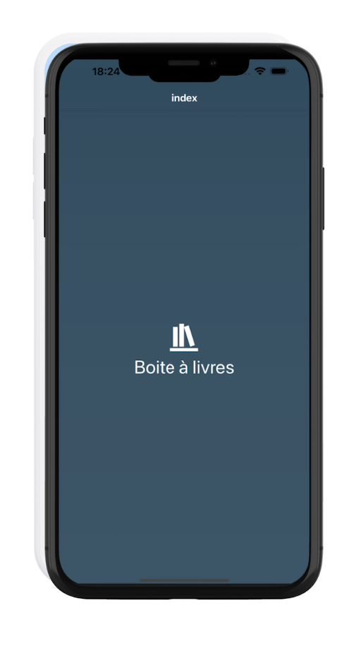
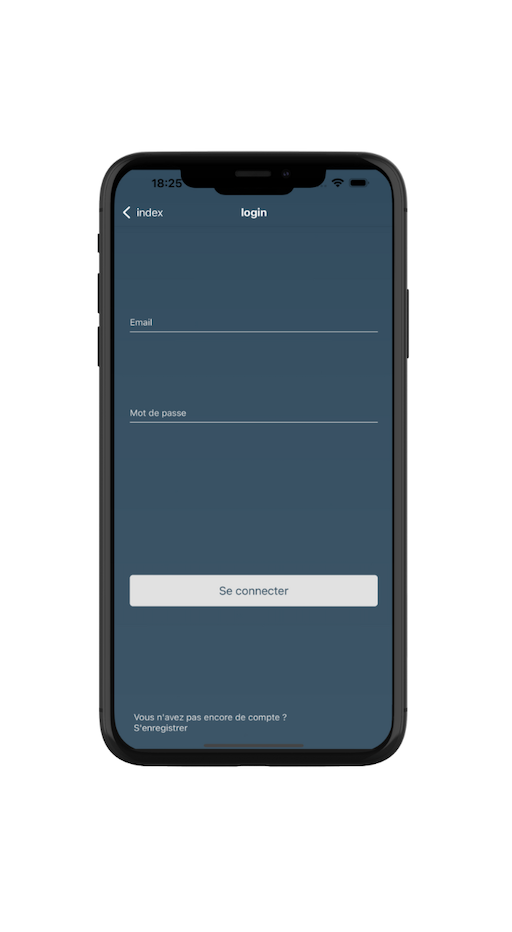

# 📚 Boîte à Livres - Votre Compagnon de Partage Littéraire 📱

## 🌟 Description
Bienvenue dans **Boîte à Livres** ! 🚀 Une application mobile faite pour les amoureux des livres et les curieux du monde 🌍. Que vous soyez à la recherche d'une nouvelle aventure littéraire ou que vous vouliez partager vos trésors de lecture, cette appli est faite pour vous. Découvrez, partagez, et explorez les boîtes à livres près de chez vous et partout ailleurs ! 📖💫

## 🎯 Fonctionnalités
- **🔍 Localisation des Boîtes à Livres** : Trouvez facilement les boîtes à livres autour de vous en un clin d'œil.
- **➕ Ajout de Nouvelles Boîtes** : Partagez vos découvertes avec la communauté en ajoutant de nouvelles boîtes.
- **📍 Recherche Personnalisée** : Cherchez une boîte à livres par ville, adresse ou nom, et trouvez exactement ce que vous cherchez.
- **❤️ Favoris** : Gardez vos boîtes préférées à portée de main pour les retrouver en un instant.
- **📲 Notifications** : Soyez alerté dès qu'une nouvelle boîte à livres est ajoutée près de chez vous. Ne manquez plus aucune occasion !

## 📸 Captures d'écran
Vous voulez voir à quoi ça ressemble ? Voici quelques aperçus de notre application en action ! 👇

  

    
  

  

    
  

## 🛠️ Installation

### 📋 Prérequis
- Un appareil mobile sous Android ou iOS.
- Une connexion Internet pour télécharger l'application et profiter de toutes ses fonctionnalités.

### 🚀 Téléchargement et Installation
1. Rendez-vous sur [Google Play Store](#) pour Android ou [Apple App Store](#) pour iOS.
2. Téléchargez et installez l'application.
3. Ouvrez l'appli, créez un compte, et c'est parti pour l'aventure ! 🎉

## 🎮 Utilisation
1. **📝 S'inscrire/Se connecter** : Créez votre compte ou connectez-vous si vous êtes déjà des nôtres.
2. **🗺️ Explorer** : Parcourez la carte pour découvrir les boîtes à livres autour de vous.
3. **➕ Ajouter une Boîte** : Partagez une nouvelle boîte en remplissant les infos nécessaires et en soumettant le tout.
4. **❤️ Favoris** : Sauvegardez vos découvertes préférées pour les revisiter à tout moment.

## 🤝 Contribution
Les idées et contributions sont les bienvenues ! Envie de participer à ce beau projet ? Voici comment faire :

1. **Fork** ce dépôt.
2. Créez une branche pour votre fonctionnalité (`git checkout -b feature/YourFeature`).
3. **Commit** vos changements (`git commit -m 'Ajout de YourFeature'`).
4. **Push** sur la branche (`git push origin feature/YourFeature`).
5. Ouvrez une **Pull Request** et montrez-nous ce que vous avez en tête !

## 👥 Auteurs
- **Julien Foucart** - *Développeur principal* - [Julien sur LinkedIn](https://www.linkedin.com/in/julien-foucart-333a40251/) - [Envoyez-moi un mail](mailto:julien.foucart@example.com)

## 📄 License
Ce projet est sous licence MIT. Consultez le fichier [LICENSE](LICENSE) pour plus de détails.

## 💖 Remerciements
Un grand merci à toutes les personnes qui ont contribué à cette application et à la merveilleuse communauté des boîtes à livres pour l'inspiration et le soutien. Ensemble, nous partageons la magie des livres ! 📚✨

---

## 🚧 Roadmap
Voici ce qui est en préparation pour les futures versions de **Boîte à Livres** :

- **🌍 Intégration de Cartes Offline** : Pouvoir accéder aux boîtes à livres même sans connexion Internet.
- **🎨 Personnalisation du Profil** : Ajoutez une photo de profil, une biographie et personnalisez vos préférences.
- **🌟 Système de Badges** : Gagnez des badges pour vos contributions et découvertes !
- **🗣️ Traduction Multilingue** : Rendre l'application disponible dans plusieurs langues.

## 💡 Idées de Fonctionnalités
Avez-vous une idée géniale pour améliorer **Boîte à Livres** ? Nous serions ravis de l'entendre ! Proposez vos idées en ouvrant une [issue sur GitHub](#).

## 🤔 FAQ
**Q** : Comment puis-je supprimer une boîte à livres que j'ai ajoutée ?  
**R** : Contactez-nous via l'application avec les détails de la boîte à livres, et nous nous en occuperons.

**Q** : L'application est-elle gratuite ?  
**R** : Oui, l'application est totalement gratuite à télécharger et à utiliser.

**Q** : Comment signaler une boîte à livres endommagée ou inappropriée ?  
**R** : Vous pouvez signaler une boîte à livres directement depuis l'application en accédant à la page de cette boîte et en cliquant sur "Signaler".

